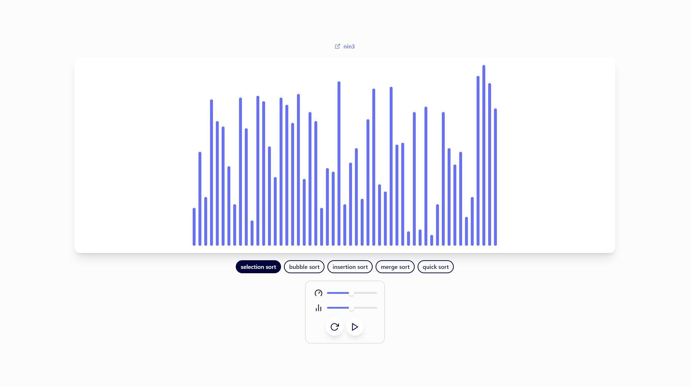
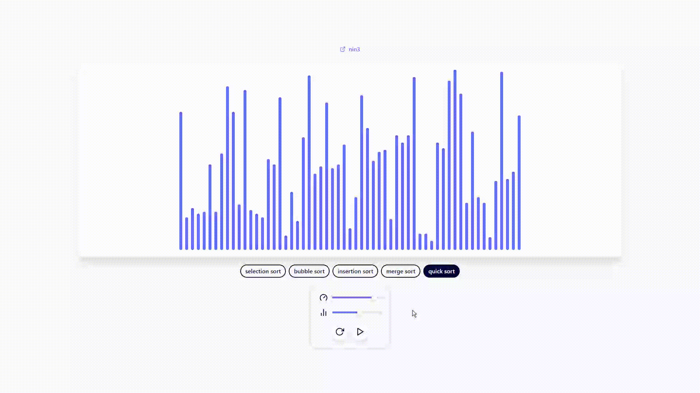

# Sorting-Visualizer ❄️

## Description

A simple sorting visualizer (using React and Tailwind) with algorithms:

- Selection sort
- Bubble sort
- Insertion sort
- Merge sort
- Quick sort

## Screenshots

Here are some screenshots of the app:

## Additional

- This project is hosted using GitHub Pages and can be visited [here](https://therealnin3.github.io/Sorting-Visualizer/).
- UI inspiration from [Hugo's sinewaver](https://www.sinwaver.com/).
